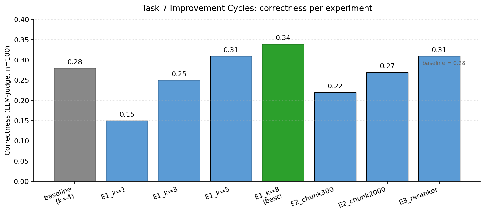

# FinanceBench-RAG

*A diagnostic RAG pipeline for SEC 10-K Q&A, benchmarked on FinanceBench.*

[](https://www.python.org/)
[](LICENSE)
[](#architecture)
[](https://colab.research.google.com/github/MGanayim/financebench-rag/blob/main/financebench_rag.ipynb)

Most RAG demos report a single accuracy number and stop. This repo takes the opposite approach: a baseline pipeline, three independent evaluation axes, and a set of one-variable-at-a-time experiments designed to tell you *which component* is actually costing you accuracy. The benchmark is [FinanceBench](https://arxiv.org/abs/2311.11944) - SEC 10-K question answering, adversarial by design.

---

## Headline Results



Baseline is a standard dense-retrieval RAG pipeline (k=4, chunk_size=1000, no reranker). "Best" is the configuration from the improvement cycles that wins on correctness without regressing the other two axes.

| Configuration | Correctness | Faithfulness (n=20) | page-hit@1 | page-hit@3 | page-hit@5 |
| --- | :---: | :---: | :---: | :---: | :---: |
| Naive generation (no retrieval, n=10 manual) | 0.20 | - | - | - | - |
| RAG baseline (k=4, chunk_size=1000, no reranker) | 0.28 | 0.79 | 0.20 | 0.33 | 0.40 |
| Best experiment (E1, k=8) | **0.34** | 0.75 | 0.20 | 0.33 | 0.40 |

*Naive generation correctness counts only `verdict == "correct"` (2 of 10) - the other 8 split as 6 refused, 1 partially correct, 1 wrong. Best experiment is E1 at k=8 (more retrieved chunks fed to the generator); the retriever and index are unchanged from baseline so page-hit columns match. Per-question data lives in `artifacts/assignment2_evaluation.xlsx` and `artifacts/assignment2_improvement_cycles.xlsx`.*

---

## Worked Example

A real question from FinanceBench, run through the full pipeline at baseline (k=4):

> **Question:** *How much does Pfizer expect to pay to spin off Upjohn in the future in USD million?*
>
> **Retrieved chunks** (top-4):
> 1. `PFIZER_2021_10K`  p70
> 2. `PFIZER_2021_10K`  p75
> 3. `PFIZER_2021_10K`  p109
> 4. `PFIZER_2021_10K`  p70
>
> **Generated answer:** *Pfizer expects to pay $1.6 billion, primarily related to restructuring corporate enabling functions, with substantially all costs to be cash expenditures, as a result of the spin-off of Upjohn (PFIZER_2021_10K, page 75).*

The generator's prompt forbids it from answering outside the retrieved context, and every fact is cited back to its source `doc_name`. When retrieval misses, the generator says so explicitly rather than falling back on prior knowledge.

---

## Architecture

The pipeline is three boxes, each of which is independently measurable:

- **Indexing** *(offline)*: PDFs are loaded page-by-page with `PyPDFLoader`, tagged with 0-indexed `page_number` metadata, split with `RecursiveCharacterTextSplitter`, embedded with `BAAI/bge-small-en-v1.5`, and persisted as a FAISS index.
- **Retrieval** *(per query)*: dense similarity search against FAISS, optionally reranked by `BAAI/bge-reranker-base`.
- **Generation** *(per query)*: retrieved chunks are formatted with `doc_name` labels and passed to `meta-llama/Llama-3.3-70B-Instruct` via Nebius Token Factory with a system prompt that forbids answering outside the retrieved context.

See [`SPEC.md`](SPEC.md) for the full engineering contract - what every component is required to do, what guarantees the pipeline relies on, and how the evaluation protocol is wired.

---

## Quickstart

**Run locally:**

```bash
git clone https://github.com/MGanayim/financebench-rag.git
cd financebench-rag
pip install -r requirements.txt
cp .env.example .env        # then fill in NEBIUS_API_KEY
jupyter lab financebench_rag.ipynb
```

**Or open in Colab:** click the badge at the top of this README. You'll need to add `NEBIUS_API_KEY` as a Colab secret before running.

Then **Run All**. First-run cost is dominated by:

- Hugging Face model downloads (~130 MB for the embedder, ~280 MB for the reranker)
- Embedding the corpus (~5-10 min)
- Ragas faithfulness on 20 rows per experiment (~10-20 min per experiment)
- Correctness judge across the full dataset (~5-10 min per experiment)

A cold end-to-end run (Tasks 1-7 + bonus) sits around 75-90 minutes. Subsequent runs reuse the FAISS index under `indices/` and the Hugging Face cache.

---

## What's Inside

- **[`financebench_rag.ipynb`](financebench_rag.ipynb)** - the full pipeline. Setup helpers at the top, one section per task below. All code lives here.
- **[`SPEC.md`](SPEC.md)** - the engineering contract. The longer-form companion to this README, defining what the pipeline must do, the data invariants it relies on, and the evaluation protocol. Start here if you want to understand the system independently of the notebook's task ordering.
- **[`artifacts/`](artifacts/)** - the graded deliverables (naive generation, run-and-compare, full evaluation, improvement cycles) as `.xlsx` files.
- **[`indices/`](indices/)** - saved FAISS stores per chunk size. Gitignored; rebuilt from the notebook's Setup section.
- **[`docs/`](docs/)** - charts and figures referenced in this README.

---

## Evaluation Methodology

Three axes, chosen because they fail independently. A single correctness number tells you the pipeline is broken; it can't tell you *where*.

| Axis | What it measures | Why it's here |
| --- | --- | --- |
| **Correctness** | Does the final answer match ground truth? Binary verdict from DeepSeek-V3.2. | End-to-end quality - what a user actually feels. |
| **Faithfulness** | Does the answer stay within the retrieved context? Ragas `Faithfulness`. | Catches hallucination even when the answer looks right. Evaluated on a fixed 20-row sample (Ragas is slow). |
| **Retrieval page-hit@k** | Did retrieval surface the page cited as evidence, for `k ∈ {1,3,5}`? | Isolates retrieval. If page-hit is low, no amount of prompt engineering will save you. |

See [SPEC.md §5](SPEC.md#5-evaluation-contract) for the exact protocol, including the Ragas + Nebius wiring.

---

## Experiments & Findings

Task 7 runs three one-variable-at-a-time experiments against the Task 6 baseline. Each varies exactly one of: `k`, chunk size, or reranker.

All deltas are vs the RAG baseline (correctness 0.28, faithfulness 0.79, page-hit@5 0.40). Each experiment row reports the best variant; full per-variant numbers live in `artifacts/assignment2_improvement_cycles.xlsx`.

| Experiment | Change | Correctness Δ | Faithfulness Δ | page-hit@5 Δ |
| --- | --- | :---: | :---: | :---: |
| E1 - k sweep (best: k=8) | k ∈ {1, 3, 5, 8} | **+0.06** | -0.04 | 0.00 |
| E2 - chunk size (best: 2000) | 300 / 1000 / 2000 | -0.01 | -0.04 | -0.06 |
| E3 - reranker | + `bge-reranker-base` (20 → 4) | +0.03 | -0.10 | -0.10 |

**Where does the pipeline fail most?** Retrieval is the binding constraint: baseline page-hit@5 is 0.40, so 60 of 100 questions have no path to a correct answer at k=5. E1's monotonic correctness gain (k=1: 0.15 → k=8: 0.34) shows the generator does extract better answers when given more context, but at k=8 correctness still lands at 0.34 against a hit@8 ceiling of 0.45 - leaving ~11 questions where the right page was retrieved but the system answered wrong. Both axes have headroom; retrieval sets the harder upper bound. The E3 paradox (page-hit dropped, correctness rose) also exposes a measurement gap: 10-Ks repeat the same numbers across summary tables and footnotes, so a chunk pulled from a non-labeled page can still answer correctly even though page-hit scores it as a miss.

**Bonus - multi-scale chunking:** chunk_size=1000 wins on `page_hit@5` (0.40 vs 0.35 for 300 and 0.34 for 2000). Of 53 "covered" questions (at least one chunk size hit), 13 have a per-question best chunk size that differs from the overall winner - **disagreement rate 13/53 = 0.245**. Dominant on average but partly query-dependent; full discussion in the notebook's bonus section.

---

## What I Learned

A few things this project surfaced that I would not have predicted from reading RAG papers alone:

- **Page-hit metrics can lie.** The cross-encoder reranker (E3) dropped page-hit at every depth yet *raised* correctness. SEC filings repeat the same numbers across summary tables, MD&A, and footnotes, so a chunk from a non-labeled page can still answer the question. Single-page-hit metrics under-credit retrievers that find equivalent-content alternatives.
- **The conventional wisdom on chunk size is wrong here.** Smaller chunks are widely advertised as "more precise". On FinanceBench's 10-K corpus, chunk_size=300 lost to chunk_size=1000 on every page-hit depth. Fragmenting content into 300-char chunks loses more in semantic coherence than it gains in granularity.
- **Three-axis evaluation is non-negotiable for diagnosis.** Looking at correctness alone, the reranker improved the system. Looking at correctness + faithfulness + page-hit together, the reranker is sketchy: faithfulness fell, page-hit collapsed, and the correctness gain is partly an artifact of the page-hit measurement gap. One number cannot replace this picture.
- **The generator was context-starved.** E1's monotonic gain from k=1 (0.15) to k=8 (0.34) on identical retrieval shows the bottleneck is at least as much "how much evidence the generator sees" as it is "what evidence the retriever surfaces". The instinct to keep `k` low for prompt cost is wrong if accuracy is the goal.

---

## Limits & Honest Caveats

- **FinanceBench is hard on purpose.** The paper reports that state-of-the-art commercial systems struggle on it. Absolute numbers here will look modest; treat them as a baseline for *your own* improvements, not as a leaderboard.
- **Faithfulness sample is small.** Ragas runs ≥1 LLM call per sample; at 20 samples this is already 10-20 min per experiment. Confidence intervals on the faithfulness column are wide.
- **No UI, no server.** This is a notebook + a saved index.
- **Citation granularity is page-level.** The system cites `doc_name + page_number`, not clause spans. Good enough for 10-Ks; not good enough for contract review.
- **Retrieval is dense-only at baseline.** Hybrid lexical + semantic retrieval is on the roadmap, not the baseline.

---

## Roadmap

Three concrete next steps, in order of expected payoff against the binding-constraint diagnosis above:

1. **Combine the two winning interventions.** Apply the cross-encoder reranker to a wider FAISS shortlist (top-30 to top-50) and feed the generator k=8. E1_k8 and E3 each lifted correctness alone; combining them should compound.
2. **Two-stage hybrid retrieval (BM25 + dense).** A weighted fusion of lexical and dense scores at retrieval time would catch the named-entity-heavy queries (ticker symbols, dollar amounts, fiscal-year markers) that the BGE embedder smooths over.
3. **Per-document filtering.** FinanceBench questions are single-doc and the company name is reliably present in the question; filtering FAISS to chunks from the relevant doc before retrieval should lift page-hit@k by several points with no model changes.

---

## Credits

- **Dataset:** [FinanceBench: A New Benchmark for Financial Question Answering](https://arxiv.org/abs/2311.11944) - Islam et al., Patronus AI.
- **Models:** `meta-llama/Llama-3.3-70B-Instruct` and `deepseek-ai/DeepSeek-V3.2` served via [Nebius Token Factory](https://nebius.ai/).
- **Libraries:** [LangChain](https://www.langchain.com/), [FAISS](https://github.com/facebookresearch/faiss), [Ragas](https://docs.ragas.io/), [Hugging Face](https://huggingface.co/) (`BAAI/bge-small-en-v1.5`, `BAAI/bge-reranker-base`).
- Submitted for the **Nebius Academy - From AI Model to AI Agent** course; the diagnostic three-axis evaluation framework, experiment design, and write-up are my own contribution on top of the assignment requirements.

---

## License

MIT.
